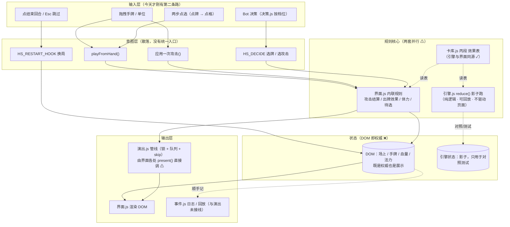
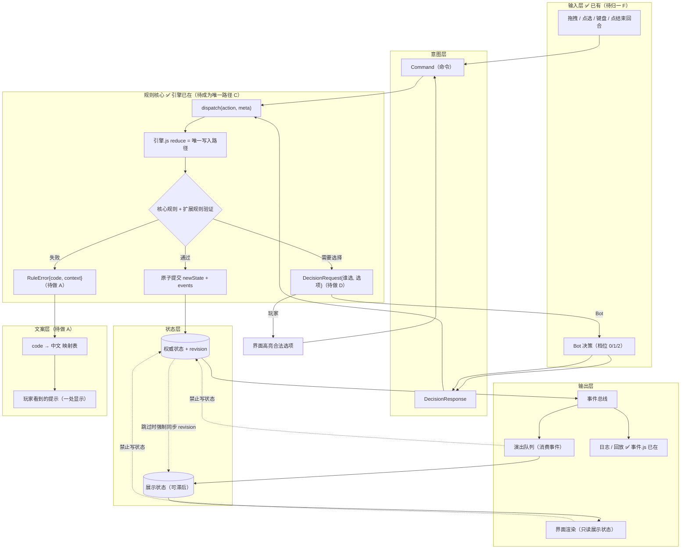

# 规划器架构：与你给的那套流程图对照（2026-10-04）

> 你给了六张图（StateReducer / RuleError → UI 文案映射 / DecisionRequest-Response /
> 权威状态 vs 展示状态 + 跳过动画 / dispatch 全流程图 / 分层架构图）。
> 这一份做三件事：**逐层对照**我们已有什么、**列出系统性改进**（每条都点名它能消灭我们哪一类 bug）、
> 并把**我们自己的架构图**画出来（现状 + 目标，Mermaid 源码，可直接贴进 mermaid.live 或 DeepSeek 看）。

---

## 一、那六张图在说什么（一句话）

1. **唯一写入路径**：所有改动都过 `StateReducer.apply(权威状态, action)`，验证通过才**原子提交** `newState + events`。
2. **失败要结构化**：验证失败 → `RuleError{ code, context }` → **UI 文案映射层** → 本地化文案 → 玩家看到的提示；日志只记 `code + context`。
3. **选择要一等公民**：需要玩家/Bot 选择时**暂停 reducer**，发 `DecisionRequest`；玩家走"界面显示合法选项 → 点击"，Bot 走"评分 → 返回"，两边都回到 `DecisionResponse`，reducer 从暂停点恢复。
4. **权威状态 ≠ 展示状态**：权威状态是规则真相，展示状态可能**滞后**在动画后面；"跳过动画" = **强制同步到最新 revision**。
5. **分层且单向**：输入层 → 意图层（Command / DecisionResponse）→ 规则核心 → 输出层（事件总线 → 演出队列 / 日志回放）；**UI 与动画禁止写状态**。

这套东西的价值不在"好看"，而在它把三类最难修的 bug **从结构上消灭**：
无反馈的失败、残留状态、两套规则各写一份。

---

## 二、逐层对照：我们已经有什么、缺什么

| 图里的东西 | 我们的对应物 | 现状 |
|---|---|---|
| StateReducer 唯一写入 + 原子提交 | `引擎.js`（`reduce(状态,命令) → {状态,事件,变更,待选择}`）+ `事件.js`（变更=施工图、`新状态=应用(原状态,变更)`、稳定哈希、可回放） | ✅ **已经有，而且是真的**（108 项断言 + 标准对局末态哈希可回放）—— 但它是**影子**：页面不走它 ❌ |
| `RuleError{ code, context }` | 引擎里是 `否('场地已满（上限 5）')` 这类**中文字符串**；界面里是 `闪提示('这一格已经有随从了…')` 散落各处 | ⚠️ **有拒绝、没有码** |
| UI 文案映射层 → 本地化文案 → 提示 | 散在 `playFromHand` / `应用战吼` / `闪提示` 各处的字面量 | ❌ 缺 |
| DecisionRequest/Response（玩家/Bot 分流） | `引擎.js 待选择` + 界面 `进入待选/待选点击` + `机器人选目标`（阶段 E） | ⚠️ 两边都有、**入口不统一** |
| 权威状态 vs 展示状态（滞后 / 跳过=追平） | `演出.js` 管线（带 reason 的锁 + 串行队列 + **skip 跳到终态**）+ **DOM 即状态** | ❌ 缺关键那一半：我们把 **DOM 当权威** |
| 事件总线 → 演出队列 / 日志回放 | `事件.js`（顺序号/因果链/席位投影/回放）与 `演出.js`（队列/原语/配方）**各自都在** | ⚠️ 但演出是由界面**直接 `present()`**，不是"消费事件序列" |
| 输入层归一 | 拖拽（原有）+ **两步点选**（2026-10-04 新增） | ⚠️ 刚有第二条，仍需归一 |
| UI / 动画**禁止写状态** | `界面.js` 既读又写（攻击结算、出牌效果、体力、待选都在它里面） | ❌ 缺（这是最深的那个洞） |

**一句话总结**：那张图上的**零件我们几乎都造过**（reducer、事件、变更、待选择、管线、跳过、Bot 决策），
但**接线方式不同** —— 它们没有串成"单一写入路径"，而是**并行两套**：引擎在影子里跑，页面用 DOM 直改。
我们这一周踩的 bug，绝大多数是这个结构差异造成的（下面逐条点名）。

---

## 三、系统性改进（按"能消灭哪一类 bug"排序）

| # | 改进 | 它消灭的 bug 家族（本会话真实案例） | 代价 |
|---|---|---|---|
| **A** | **拒绝结构化**：引擎 `否(code, context)`；界面只做 `code → 中文` 的映射 + **一处**显示；日志只记 code | 「点了没反应 / 静默失败」家族 —— 本次会话踩了 **5 次**：自己的面板盖住手牌、指示条盖住按钮（"卡死"）、蒙版残留在我的回合、`#fireworkCanvas` 吞点击、出牌被拒时只有一行没人看得到的 console | 小（约一天） |
| **B** | **权威/展示分离 + `revision`**：DOM 从"状态"降级为"渲染结果"；展示状态可滞后；跳过 = 追平 revision | 「残留状态」家族 —— 页内重开时上一局的指示条/面板/蒙版/待选跟着进新局（连续 3 个 bug 都是它）；「锁卡死」（演出没播完，锁没释放） | 中 |
| **C** | **引擎成为唯一写入路径**：界面 `dispatch(命令)`；引擎输出事件；界面只**消费事件**渲染/演出 | 「两套规则各写一份」家族 —— 上游无条件反击 vs 引擎不反击（我们为此写了整轮"战斗规则重定"）；"改了 A 忘改 B" | 大（阶段 F/G 的终点） |
| **D** | **决策统一出口**：`DecisionRequest{ 谁选, 选项, 上下文 }`，玩家/Bot 都从它出 | 「选错人问」家族 —— 敌方战吼问玩家选目标（B39 那条：界面疯狂提示"选一个目标"、玩家按不出卡） | 小 |
| **E** | **演出消费事件**：`present()` 由事件序列驱动，而不是界面各处手动调 | 「演出与状态不同步」家族 —— 箭头指向错格、抽牌"先落手后播动画"、按钮在动画没播完就变绿 | 中 |
| **F** | **输入层归一**：所有输入 → Command 的唯一映射表 | 「验证盲区」家族 —— 合成事件绕过命中测试，让我连续三次把"被盖住/点不通"当成"已修好"（面板、指示条、画布） | 小 |

**建议顺序：A → D → F → B → E → C**（先小后大、先止血）。理由：
A/D/F 是"小改动、立刻减少噪音"，做完之后**剩下的问题会自己浮出来**（因为不再有静默失败与选错人的噪音）；
B 让"重置"变得可靠（页内重开那串 bug 的根）；E/C 才是大改，而且 C 与既定的阶段 F/G（自写渲染、删上游）是同一件事。

---

## 四、我们自己的架构图

### 4.1 现状（如实画：两条路并行）

### 4.2 目标（按那套图接线；括号里是完成度）

### 4.3 差距一览（哪块是"已有/影子/缺"）

| 层 | 状态 |
|---|---|
| 输入层 | ✅ 有（拖拽 + 点选 + 跳过 + Bot），**待归一**（F） |
| 意图层 | ⚠️ 有，但入口散落（`playFromHand` / `应用一次攻击` / `HS_DECIDE`） |
| 规则核心 | ✅ 引擎/事件齐备且可回放；❌ **不是唯一写入路径**（影子） |
| 状态层 | ❌ **缺**（DOM 即权威，没有 revision、没有展示/权威分离） |
| 输出层 | ⚠️ 管线与事件各自都在，**未接线**（演出不由事件驱动） |
| 文案层 | ❌ 缺（拒绝是裸字符串） |
| 边界约束 | ❌ 缺（界面既读又写） |

---

## 五、每一步的验收口径（照本项目一贯的规矩：都要机器可验）

| 步 | 断言 |
|---|---|
| A | 引擎里每一条拒绝都带 `code`；界面代码里不再出现裸中文拒绝字符串；自检加一条「没有 code 的拒绝 = 0」 |
| D | 引擎只从 `DecisionRequest` 出选择；自检「敌方战吼不产生玩家待选」；界面高亮的选项 == Request 里的选项集合 |
| F | 输入 → Command 的映射只有一处；给"点不通"这类问题加**命中测试断言**（`elementFromPoint`）—— 本会话已经吃过三次亏 |
| B | 每次状态变更 `revision + 1`；强制制造"展示落后"再跳过，断言两者 revision 追平；页内重开之后「瞬时图层全 off」 |
| E | 给定同一串事件，演出顺序稳定（可断言）；回放能复现同一段演出 |
| C | 界面里没有对场上/手牌/血量的直接写；引擎成为唯一写入路径后，老路径的对照清单（`工具/对照清单.md`）里"不一致"必须归零 |

---

## 六、改进 A 已落地（2026-10-04）：拒绝结构化

**做了什么**（照流程图那一条 `RuleError{ code, context }` → UI 文案映射层 → 玩家看到的提示）：

| 件 | 落点 |
|---|---|
| **码表**（原因前缀 → 机器码，27 条） | `游戏/引擎.js` 模块作用域 + `否(原因, 上下文)` 一律返回 `{合法:false, 原因, 码, 上下文}` |
| **文案映射层**（码 → 中文模板，`{占位}` 替换） | 新文件 `游戏/文案.js`（`HS_TEXT.取(码, 上下文)`；缺失占位退化成「?」而不是 undefined） |
| **界面唯一出口** | `游戏/界面.js` 的 `提示码(码, 上下文)`；原先散落的裸中文拒绝（出牌被拒 ×2、战场已满 ×2）全部改成码 |
| **机器检查** | 页面自检 **㉛** 两条（引擎拒绝抽样都带码 / 27 个码都有中文文案）+ `test_engine.mjs` 新增"拒绝结构化"段 6 条 |

**为什么用"一处映射表"而不是改 28 个调用点**：改动越小越不容易出错 —— 一处补齐，全引擎的拒绝自动带码；
`上下文` 仍可按需补。踩到的坑也记一笔：**第一个版本把码表写在 `合法()` 函数里面**，导出给自检时
直接 `ReferenceError: 码表 is not defined` —— 声明放哪儿也是要挑的（`test_engine` 当场抓住）。

**验收（都是机器验的）**：

- 四套断言 **501 项 0 失败**（test_engine 108 → **114**：新增"空手牌出牌/怪命令/不是你的优先权/攻击不存在的单位 → 拒绝带码"、"码表 ≥20 条"、"码都是大写字母下划线"）。
- 页面自检 **33/33**（31 → 33，多的是 ㉛ 两条）。
- 浏览器实测一次真拒绝：拖一张 **Ghoul（2 费，手上只有 1 点）** → 提示 **「法力不够：Ghoul 要 2 点，你只有 1 点」**（这句由 `文案.js` 的模板渲染，界面里不再有裸字符串）。
- 沙盒卡重新打包 + 校验：**0 错误 / 12 警告 / 17 通过**。

## 七、改进 D 已落地（2026-10-04）：决策统一出口

**问题**：`DecisionRequest{ 谁选, 选项, 上下文 }` 这件事我们**有三处各知道一半** ——
"谁该选"写在 `应用战吼` 里、"Bot 怎么选"写在 `机器人选目标` 里、"玩家怎么点"写在 `待选点击` 里。
三处各半套规则的直接后果就是那个 bug：「敌方战吼问玩家选目标」（界面疯狂提示"选一个目标"、玩家按不出卡）。

**做了什么**：

| 件 | 落点 |
|---|---|
| **唯一出口** | `游戏/界面.js` 的 `发起决策(请求)`：`谁 === 'player'` → 进待选（高亮 + 提示）；否则 → 交给 Bot 决策 |
| **请求形状只有一处定义** | `{ 谁, 种类, 席位, 效果, 选项, 上下文 }`；`进入待选(请求)` 改成吃**一个对象**（原来是四个散装参数） |
| **Bot 的目标策略搬进决策层** | `游戏/决策.js` 的 `选目标(席位, 效, 目标描述符)` —— **纯函数**（吃席位/攻/血量/是不是英雄）；界面只负责"DOM 选项 ⇄ 描述符"的翻译 |
| **老函数删除** | 界面里的 `机器人选目标()` 整段删掉（留着就是"两处各知道一半"，正是 D 要消灭的） |
| **机器检查** | 页面自检 **㉜** 两条（唯一出口在 + 请求形状唯一）+ `test_campaign.mjs` 新增 **C2 段 7 条**（纯策略：伤害砸对面/能打死优先/只剩英雄打脸；加成给自己人/优先随从；空选项 −1；兜底第一个绝不凭空落空） |

**验收**：四套断言 **507 项 0 失败**（test_campaign 127 → **135**，多的是 C2 那 7 条 + ……）；
页面自检 **35/35**（33 → 35）；浏览器实测：出 Voodoo Doctor（带战吼）→ 待选里挂着的是
`{ 谁:'player', 种类:'战吼目标', 选项数:3, 上下文:{卡名:'Voodoo Doctor'} }` ✓，放弃后 `待选 = null` ✓。

**踩到的坑（记一笔）**：C2 的两条断言我一开始按"列表下标"写期望值，而实现返回的是**描述符里的 `i`** ——
两条当场红。**是测试写错了、不是代码错了**（把期望改成描述符的 i 就绿）。这正说明"纯函数 + 断言"这套值：
期望值写错会立刻暴露，而不是等到实机上表现为"选错了目标"。

## 八、改进 F 已落地（2026-10-04）：输入层归一

**问题**：输入有好几条路（拖拽手牌、拖拽单位、两步点选、Esc/右键、Bot 决策），**每条各自调执行器** ——
"出牌"被好几处直接调、每处各自决定"能不能出、出到哪"。本会话最痛的一次教训恰好出在这里：
我一直用**合成事件**验拖拽，于是"真实点击走不通（被面板/指示条/画布盖住）"查了三轮才发现 ——
**每种输入各验一遍**这种事，靠人力一定会漏。

**做了什么**：

| 件 | 落点 |
|---|---|
| **意图对象** | `{ 类型: '出牌', 卡, 格子 }` · `{ 类型: '攻击', 攻方, 目标, 目标型 }` · `{ 类型: '选目标', 目标 }` |
| **唯一出口** | `游戏/界面.js` 的 `执行意图(意)`：先 `合法意图()` 验参数（元素是否还在文档里、格子是不是数字、有没有越界…），再交执行器 |
| **两条输入合成一条** | 拖拽落格 与 点选落格 **发同一条"出牌"意图**；玩家与 **Bot** 发同一条"攻击"意图 |
| **非法意图必留痕** | 参数不合法 → `报(0, 'UI_INVALID_INPUT', …)`（进检错层）+ **不静默**；执行器抛异常也在这里兜住并记 `严重` |
| **攻击演出抽出来** | `发起攻击演出(攻方, 目标, 类型)`（原来内联在 onUp 里，现在玩家/Bot/两种输入共用一个） |
| **机器检查** | 页面自检 **㉞** 两条（意图层在位 / **非法意图被拦下且留痕**） |

**明确没纳入的**：「结束回合」仍走上游那个按钮（+ 我们的 `wo` 叙述包装）—— 它牵扯上游整套回合机件，
硬接过来收益小、风险大；这条**写在代码注释里**，不装作已经归一。

**验收**：四套断言 **509 项 0 失败**；页面自检 **39~40/40**（随关卡 39 或 40，含 ㉞ 两条）；
浏览器实测两条路**各自**都记到同一种意图：
拖拽落格 → `{出牌: 1}` ✓；点手牌→点格子 → `{出牌: 1}` ✓（Elven Archer 落场、手牌 3→2 ✓）；
非法意图（`{类型:'这不是一种意图'}`）→ 被拦下 + 检错层记到 `UI_INVALID_INPUT` ✓。

## 九、改进 B 第一块已落地（2026-10-04）：权威状态 + revision（观察式）

**要解决的那件事**：我们现在**DOM 既是权威也是展示**。这一周踩的坑大半从这来 ——
页内重开要"清一堆瞬时图层"、演出与状态不同步、跳过动画没法校验（没有权威可比）、
检错层做不了 `ATOMIC_VIOLATION / REVISION_GAP / PRESENTATION` 那几条。

**为什么先做"观察式"**（过渡形态，理由写在代码里）：把每个游戏动作都翻译成"变更"前提是整局建模
（单位 id、格子、区域…），那是阶段 C 的活。而我们已经有**唯一意图出口**（F）与**结构化拒绝**（A），
所以先把**能立刻兑现价值**的那半做掉：

| 件 | 落点 |
|---|---|
| **权威状态 + revision** | 新文件 `游戏/状态.js`：`{revision, 展示revision, 回合, 法力, 法力上限, 席位{英雄血, 场上[]}, 手牌[]}` |
| **提交（唯一写入路径）** | `提交(取, 原因)`：采一份 → 与上次**求差**得到 变更/事件 → revision + 1 → 校验三条（见下）→ 记日志 |
| **对账（"两套真相"探针）** | `对账(取)`：把当前 DOM 采一遍与权威比；**非提交点的任何 DOM 变化都会现形** |
| **追平（跳过动画 = 强制同步）** | `追平(画)`：按权威重画关键数字（血量/法力/攻血）+ 标记 `展示revision = revision` |
| **提交点** | 建立 / 出牌（**等异步落定后 120ms**）/ 攻击结算 / 回合开始 / 敌方回合结束 |
| **三条检错码** | `ATOMIC_VIOLATION`（应用(旧,变更) ≠ 新）、`REVISION_GAP`（版本不连续）、`LOG_INCOMPLETE`（有变更无事件）——**全部接进检错层** |
| **恢复动作** | `UI_WRONG_SOURCE / ATOMIC_VIOLATION / REVISION_GAP` 的恢复 = **按权威追平**（不猜哪个对） |
| **机器检查** | 页面自检 **㉟** 四条：状态层在位 / revision ≥ 1 / **对账为空** / **偷改 DOM 能被抓到且追平能改回** |
| **不碰 DOM** | 状态层只吃注入的取值器与画笔 → 核心逻辑能在 node 里直接测（界面负责 DOM） |

**★ 它当场抓到的第一个真 bug**（值得记）：出牌后对账立刻报 `法力` 与 `player.场上` 不一致 ——
因为上游的**扣费在 `setTimeout(…, 0.01)` 里、落场在 MutationObserver 的微任务里**，
我同步提交采到的是"还没扣费、卡还没上场"的旧值。**修法：提交点等异步落定**
（`setTimeout(提交, 120)`）—— 这正是"权威状态"该有的纪律：**只在局面真正定型的那一刻采**。

**验收**：四套断言 **509 项 0 失败**；页面自检 **44/44**；浏览器实测
`#1 建立(1 事件) → #2 敌方回合结束(0) → #3 回合开始(0) → #4 出牌(3 事件)`，
每次提交后 `对账 = []`（权威与 DOM 一致）；自检里故意把血量改掉 7 点 → **对账抓到** → `追平()` → **对账恢复为空** ✓。

### 9.1 用户实测报的三个问题（2026-10-04 晚）与修法

用户报：① 「导出报错无法点击」；② 「攻击玩家时血量变红但数值不减」；③ 「敌方单位攻击时移动两次，
先扣一次体力、再打一次才造成伤害」。

| # | 根因 | 修法 |
|---|---|---|
| ① | 我们那颗「导出本局信息」append 进上游抽屉 `#gamemenuContent`，而那里的按钮是**绝对定位**的 —— 我们的按钮正好压在 Concede 底下（`elementFromPoint` 命中 `concedebutton`）。抬 z-index 到 41 也没用（层叠上下文压不过） | 挂进抽屉的**标题栏** `#gamemenuTitle`（永远在最上面）。实测命中 `hs-report-btn` ✓、点开报告面板 507 字 ✓ |
| ② ③ | **同一个根因，而且是我上一轮 F 接线引入的**：敌方计划里的攻击 `apply` 改成走 `执行意图` 之后，它**又发起了一次攻击演出** —— 一次攻击被演两遍：第一遍只播了飘字（红字 ✓ 但没结算 ✗）、第二遍才落地伤害与体力 | `执行意图` 增加 `已演出: true`（敌方计划专用：那条路已经由管线播过"箭头→冲上去→打击"，只需在**它自己的那一拍**落地结算） |

**B 自己也被这一轮抓出两个接线错误**（都是"提交点放在哪"的问题）：

1. **建立期提交太早**：`buildChrome` 跑在启动那一刻，`#cards` 还是空的、法力还是 0/0 →
   拿它当基准，之后真实的发牌/进对局全成了"对账不一致"，**更糟的是追平会拿过期权威把真实进度改回去** ✗。
   修法：**等发牌之后再建基准**（轮询到 `#cards` 有牌）。
2. **提交定时器写在"安装包装"那一刻**（加载时只跑一次）→ 采到的是开机瞬间的空账，
   真正的回合变更之后再没人提交，对账永远报 回合/法力/手牌 不一致 ✗。
   修法：把提交点**写进包装函数体里**（`wp` / `wo` 体内）—— 这是"提交点必须在'这一拍真的发生了'的地方"。
3. 顺带一条**安全收紧**：`UI_WRONG_SOURCE`（对账不一致）**不进自动恢复表** ——
   不一致**未必是 DOM 错**，也可能是权威自己过期；那时"按权威追平"会把真实进度改回去 ✗。
   它只**上报**，由自检/人判断；自动追平只留给提交层自己发现的断层（`ATOMIC_VIOLATION` / `REVISION_GAP`）。

**复验**：页面自检 **44/44**；走完整一回合后 `对账 = []`、日志 `#1 建立(1) → #2 敌方回合结束(0) → #3 回合开始(4 事件)`；
直接调 `_应用一次攻击` 打**两个英雄**都正常（我方 30→28、敌方 40→39，事件均为「伤害 X + 体力 -1」）。

### 9.2 用户导出「本局信息」后的第二次修复（2026-10-04 深夜）

用户导出里最关键的一行：
`{"verb":"attack","toKind":"player","落地":false,"实扣血":0,"攻方":"Devout Adventurer","攻方攻击力":"2","目标":"opposinghero"}`
—— **攻击没落地**（前/后血量一模一样），而且 **`报错: null`**（没抛错，只是被静默拒绝）。

**根因：我在 F 里给输入层加的合法性判据太严**。`合法意图()` 当时写的是
`if (!意.攻方 || !意.攻方.isConnected) return '攻方不在文档里'` —— 在我们的 DOM 里这条会**误判**
（那个单位明明在场上、可见、能打）。同一局两条路径的对照：

| 路径 | 结果 |
|---|---|
| 直接调 `_应用一次攻击(我方单位, 敌方英雄, 'player')` | **落地 true** ✓ 40→38、事件「伤害 2 + 体力 -1」 |
| 走玩家真实路径 `_执行意图({类型:'攻击',…})` | **`{成:false, 原因:'攻方不在文档里'}`** ✗ 被自己的输入层拦掉 |

**修法**：判据改为"**在文档里 或 有布局盒**"（`isConnected || getClientRects().length`），
并把 `isConnected` 与布局盒两个事实都写进拒绝上下文 —— 下次真出错时，导出信息里能直接看出是哪一种。

**复验**：`_执行意图` 返回 `{成:true}` ✓、敌血 **40→39** ✓、`lastStrike` **落地 true / 实扣血 1 / 报错 null** ✓、
意图计数 `{出牌:1, 攻击:1}` ✓、页面自检 **45/45** ✓。

**教训（已记成规矩）**：**输入层的判据要比"我以为的严格"宽一档** ——
校验的目的是挡住"元素没了、参数是 NaN"这种真错，**不是挡住玩家合法的操作**；
判据写严的症状恰恰最难查：**没有报错、只是什么都不发生**。
而且这类问题**必须走"真实路径"验**：上一轮我用直接调 `_应用一次攻击` 证明攻击是好的，
可**玩家那条路（意图 → 演出 → 打击那一拍）根本没被覆盖** —— 这正是 F 想解决的问题本身。

1. `PRESENTATION_AHEAD` / `ANIM_WRITE_STATE` —— 需要"动画层不许写状态"这条边界（改进 C），
   现在只能做到"展示版本号可查、追平可强制同步"。
2. **把提交点换成真变更**：阶段 C 把动作翻译成 `变更`（`置/压入/抽出`）之后，
   "采 + 求差"换成"直接提交变更"，revision/事件/对账/追平**一个字都不用改**。
3. `LOG_INCOMPLETE` 的完整口径（可回放性）挂到运行期 —— 现在由"变更必有事件"守着一半。

