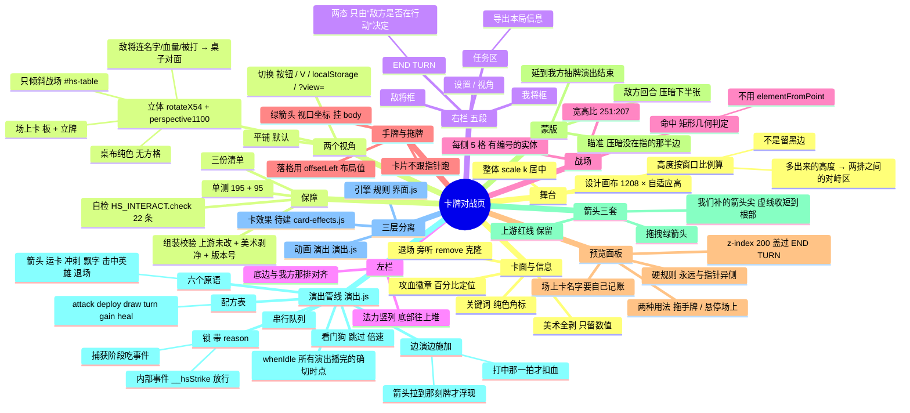

# 设计思维导图（为什么是这样）

> 用两种写法给同一张图：**Mermaid**（支持 mindmap 的阅读器直接渲染）+ **缩进大纲**（任何地方都能读）。
> 末尾专设一节：**"为什么会这样"** —— 用你贴的那份导出逐项对因。
> 更细的说明见 `对战页面设计说明.md`（每处的思路与要求）、`分层与已修问题.md`（分层与坑）、
> `变更清单.md`（谈定即入册）、`动画管线清单.md`（待做全量）。

---

## 一、Mermaid 版



---

## 二、缩进大纲版（同一张图）

```
卡牌对战页
├─ 舞台
│  ├─ 设计画布 1208 × 自适应高，整体 scale(k) 居中
│  └─ 高度按窗口比例算 → 多出来的高度变成两排之间的对峙区（不是留黑边）
├─ 两个视角
│  ├─ 平铺（默认）
│  └─ 立体：rotateX 54° + perspective 1100px
│     ├─ 只倾斜战场（#hs-table）；手牌/右栏/法力条/箭头/蒙版不参与
│     ├─ 桌布纯色（无方格纹理）
│     ├─ 场上卡 = 桌上的板 + 板上立着的小牌
│     └─ 敌将连同名字/血量/被打效果 → 桌子对面
├─ 右栏五段
│  ├─ 设置 / 视角（两颗按钮）
│  ├─ 敌将框
│  ├─ END TURN（两态，只由"敌方是否在行动"决定）
│  ├─ 我将框
│  └─ 任务区（含「导出本局信息」）
├─ 左栏：法力竖列，水晶从底部往上堆，底边与我方那排对齐
├─ 战场
│  ├─ 每侧 5 个**有编号的实体**格子
│  ├─ 宽高比 251:207
│  └─ 命中一律矩形几何判定（不用 elementFromPoint：全屏覆盖会让它永久落空）
├─ 手牌与拖牌
│  ├─ 卡片不跟指针跑（留在手牌里，只压暗）
│  ├─ 绿箭头在视口坐标系、挂 body
│  └─ 落格坐标用 offsetLeft（布局值），不用投影矩形
├─ 预览面板
│  ├─ 拖手牌：名字/费用/攻血/文案
│  ├─ 悬停场上卡或英雄：名字/攻血（名字由我们记账）
│  ├─ 硬规则：永远与指针异侧
│  └─ z-index 200（盖上上游那颗 50 的按钮）
├─ 蒙版
│  ├─ 瞄准时压暗没在指的那半边
│  └─ 敌方回合压暗下半张，延到我方抽牌演出结束
├─ 箭头三套：上游红线 / 我们补的尖（虚线收短到根部）/ 拖拽绿箭头
├─ 演出管线（演出.js）
│  ├─ 一把带 reason 的锁（捕获阶段吃事件；内部事件 __hsStrike 放行）
│  ├─ 串行队列 + 六个原语（箭头/运卡/冲刺/飘字/击中英雄/退场）
│  ├─ 配方表：attack / deploy / draw / turn / gain / heal
│  ├─ whenIdle()：所有演出播完的**确切时点**
│  └─ 边演边施加：打中那一拍才扣血、箭头拉到那刻牌才浮现
├─ 三层分离（目标结构）
│  ├─ ① 引擎（规则）界面.js
│  ├─ ② 动画（演出）演出.js
│  └─ ③ 卡的特殊效果 → 待建 card-effects.js
└─ 保障：组装校验 / 195+95 单测 / 自检 22 条 / 三份清单 / 每轮快照
```

---

## 三、为什么会这样（用你那份导出逐项对因）

你贴的那次攻击：**敌方 `cpuCardInPlay2`（5 攻）打我方 `Saronite Chain Gang`（2 攻 / 3 血）**。

**先说结论：这一次交换是算对的。** 数字能对上：

| 你导出里的数 | 含义 |
|---|---|
| `前.playerCardInPlay2: "3"` → 后**消失**，`目标还在: false` | 我方那只被 5 点打死（3−5=−2），随后被移除 ✓ |
| `前.cpuCardInPlay2: "3"` → `后: "1"` | 敌方那只挨了我方的 2 点（3−2=1）✓ 反伤正确 |
| `playerhero` 26 / `opposinghero` 35 都没动 | 这次是**单位互换**，不是打脸 ✓ |

**那两处看起来不对的，其实是诊断的显示问题：**

1. **`anon5: "-2"`** —— 不是"凭空多了一个 −2 血的单位"，而是**我做的退场克隆体**。
   上游移除死亡单位时只有一句 `remove()`（没有过程），所以我旁听 `remove`、
   **克隆一份回原位演退场**。克隆体保留原卡的类名（所以仍然匹配 `.cardinplay`）、
   但**没有 id** → 快照里就成了 `anon5`，血量停在"临死那一刻"的 −2。
   → 已修：快照**排除退场克隆体**（`hs-fx-ghost`），以后的导出不会再出现这种鬼影。

2. **`实扣血: null`** —— 因为目标在那个窗口里**被移除了**，`后` 里没有它的键，
   前后对不上就算不出差值。→ 这类"被打死"的情况，看"目标还在: false"就够了；
   我也可以再补一个 `击杀: true` 的字段（下次要就说）。

**顺带一个你会关心的问题：为什么这次是"敌方先打"？** 因为敌方回合是
**先规划（只看不碰）→ 队列按序播 → 每一条在它自己那一拍施加**：
`turn(敌方回合) → draw → deploy → attack`，attack 那一条播到"撞击"那一拍才扣血。
所以你在画面上看到的顺序，就是清单里的顺序 —— 不是"先扣完再演一次"。

---

## 四、一次攻击的完整链路（"3 攻打成 4/5 点"就是在这里出的）

```
玩家拖我方单位 → 松手
└─ ① 起手校验（界面.js onDown）
   ├─ 锁着？→ 不吃
   ├─ 单位没有 canAttack（这不是它的回合/已打过）→ 红框抖一下，不起手   ← 防"静默忽略"
   └─ 通过 → 画瞄准线（上游那条红线 + 我们补的箭头尖）
└─ ② 松手（界面.js onUp）
   ├─ 收起瞄准线整层（clearAimLine，但不碰 currentAttacker）
   └─ 交给演出管线：present({verb:'attack', from:单位, to:目标, onStrike})
└─ ③ 演出（演出.js attackRecipe）
   ├─ 画箭头（描边生长）→ 冲上去 → 到"打中"那一拍
   ├─ onStrike：**补发一次 mousedown 给目标**（上游那套结算由此触发）
   │   ├─ 上游 attack.js 的分支：currentAttacker 是谁 → 打谁 → 扣多少
   │   ├─ 读攻击力 = 当前攻击方元素 children[0].children[0] 的文本
   │   ├─ 护盾/嘲讽处理要读 children[2] → **缺这个节点就抛错、后面整段不执行**（已修：补空 div）
   │   └─ 伤害 = 攻击力 × **这次 mousedown 被上游处理器执行的次数**
   │        ⚠ 上游 attack() 每个我方回合都对所有 .cardinplay 再绑一遍 mousedown
   │          → 回合越往后、执行次数越多 → 3 点变 4 点、5 点（已修：attack() 改幂等）
   ├─ 飘伤害数字（打英雄再加一圈冲击环 + 震动）
   └─ 移回原位
└─ ④ 诊断（演出.js lastStrike）—— 每次都记：
     攻方 / 攻方攻击力 / 实扣血 / 目标 / 目标还在 / 结算时currentAttacker / 报错 / 前后快照
     （排除退场克隆体，避免 `anonN: "-2"` 这种鬼影）
```

**所以"为什么变成 5"**：不是规则算错，而是**同一段结算被重复执行**。
自证方法是看倍数关系：`实扣血 ÷ 攻方攻击力 = 整数` → 就是重复执行；
`= 1` 才是正常。修复后应当恒为 1。

---

## 五、下次导出怎么读（速查）

| 字段 | 正常 | 异常时说明什么 |
|---|---|---|
| `落地: true` | 结算真的改了数值 | `false` 看下面四项 |
| `攻方攻击力` vs `实扣血` | 两者相等 | 实扣是攻击力的整数倍 → 监听器累积（已修，若复现请报我） |
| `目标还在: false` | 目标被打死移除 | 若不是打死却 false → 时序问题 |
| `结算时currentAttacker` | 等于攻方的 id | `null` → "攻击方被清空"的老问题（英雄/单位不同路径） |
| `报错` | `null` | 有值 → 上游那段抛异常，贴给我就能定位 |
| 自检 `就绪: true` | 22 条全过 | 红了看是哪条；若名称是**旧文案**，说明页面还在跑缓存里的旧脚本，强刷 |
