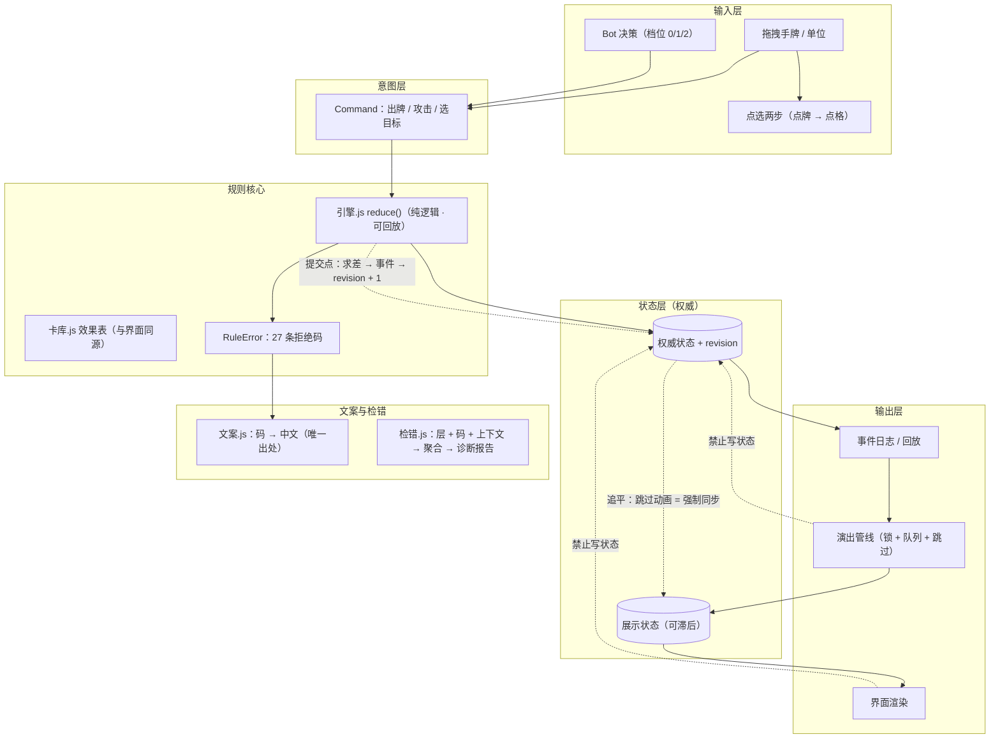

# 关卡挑战版 · 单人卡牌闯关（纯前端 · 无联机）

> 一份**自己写架构、自己写规则、自己写界面**的单人卡牌闯关：五关阶梯、部署格数逐关递增、
> 三档 AI、进度存档，**全程没有任何联机代码**。
> 本文件由 `打包展示.py` 从 `开源卡牌案例/展示-README.md` 复制而来；包内还随附 4 个
> 逐字第三方文件（页面在加载它们），来源与许可见 `来源与许可.txt`。

---

## 一分钟跑起来

```bash
cd 展示-关卡挑战版
python 工具/启动.py            # 起静态服务并开浏览器（默认 8642）
# 或者：python -m http.server 8642 然后开 http://127.0.0.1:8642/
```

进入后**自动跳过开场门槛**，直奔我们自己的主页面：

| 入口 | 干什么 |
|---|---|
| **卡牌图鉴** | 列出全部卡（费用 / 身材 / 词条 / 说明），数值与规则**同源** |
| **开始游戏** | **挑战关**：五关，**格数逐关 +1**（第一关双方各 1 格 → 第五关 5 格），按进度解锁<br>**自由关**：双方各 **1 / 3 / 5 格**三档 |
| **更多内容** | 占位一键 |

想直达某一局：`?level=1`…`?level=5`（挑战关）、`?free=1|3|5`（自由关）。

**玩法要点**（完整设计见 `说明/2-设计-页面说明.md` 与 `说明/7-进度-变更清单.md`）：
法力每回合 +1、出牌、攻击；**打人不挨反击**（除非目标带「反击」词条，且**打完还活着**才还手）；
出手要付 `攻耗` 体力（付到 0 就死），本回合没出手的随从回合结束回 `恢复` 点血；
牌桌按 1208×720 设计画布等比缩放；手牌上限 10；部署位数量由关卡决定。

---

## 架构

零件不稀奇，**接线方式**才是这一版的重点。照「唯一写入路径 + 事件驱动 + 权威/展示分离」接线：



（完整版与"现状 / 目标"两张图在 `说明/13-架构-规划器与流程图对照.md`。）

**几条已经立成规矩的东西**（都是踩过坑换来的，代码注释里写了"为什么"）：

1. **改能力，不改调用点**：接管既有行为一律是"换掉那个函数 / 包装它"，
   仍在分发的第三方文件逐字不动（`工具/组装.py` 会逐字节校验这件事）。
2. **一个量只许有一个写入点**：`freshDeck`（发牌）、`法力上限`（资源层）、`文案`（玩家看到的话）。
3. **拒绝必须结构化**：引擎 27 条码 + 界面 `提示码(码, 上下文)`；玩家看到的每句话只在 `游戏/文案.js` 里维护。
4. **输入先变成意图**：拖拽与点选发**同一条**出牌意图，玩家与 Bot 发**同一条**攻击意图 —— 于是"某种输入方式坏了"不会漏过测试。
5. **权威状态 ≠ 展示状态**：`revision` 每次提交 +1；展示可以滞后在动画后面；"跳过动画"= 强制追平到最新版本。
6. **检错分四道闸**：构建期（`组装.py`）/ 装载期（进沙盒）/ 运行期（不变量 ㊲㊳ 等）/ 回归期（断言 + 页面自检）。
7. **要分发的树，整树复制；只允许"排除"，不允许"搬家"**。
   起因见 `打包展示.py` 顶部的事故记录：把 `styles.css` / `index.js` / `src/scripts/*` 搬进子目录后，
   引用全部落空，包打开是裸 HTML —— 而当时的自检 35 项全绿，因为**没人查过文件在不在**。
8. **检查必须既有牙（该红会红）又不无理取闹（不该红不红）**：
   ① "文件在" ≠ "生效"，判据要用**加载事实**（样式表在不在 `document.styleSheets`、规则是否非空），
      不要用"计算结果"（我们自己的深蓝底色就把"body 必须是纯黑"这条判据误伤过）；
   ② 每条断言都写清**它在什么状态下才成立**（空闲态？演出中？舞台可见？立体视角？）——
      ⑦ 用布局坐标而不是投影矩形、㉚ 要求舞台可见、㉝㉟ 在演出中只放行展示层的码，都是这条。

---

## 怎么验（都可以自己跑）

```bash
cd 展示-关卡挑战版

# ① 静态引用闸门：页面引用的每个本地文件，是不是就在那个位置（不跑浏览器，5 毫秒）
node 工具/引用体检.js .

# ② 五套断言（一条命令跑完）
node 工具/跑全部测试.mjs
# 或者逐套跑：
node test_engine.mjs      # 纯引擎：状态检查 / 优先权 / 可插堆叠 / 标准对局回归基线
node test_levels.mjs      # 关卡表 / 牌组 / 卡表逐张与冻结基线核对
node test_campaign.mjs    # 关卡层 + 资源层 + 决策层
node test_对照.mjs        # 老路径 vs 新引擎的双跑对照 → 生成 工具/对照清单.md
node test_状态.mjs        # 权威状态层：提交自洽（能重放）+ 有牙（丢信息必须报）
```

浏览器里再敲一句（页面自检 **48 条**，含"本地资源齐备""样式真的落到元素上"
"关键落点没被图层盖住""偷改 DOM 会被对账抓到"这类）：

```js
HS_INTERACT.check()                       // → { 通过, 失败, 总数, 就绪 }
HS_CHECK.报告()                            // → 全链路检错的诊断报告（层 + 码 + 上下文 + 最近记录）
HS_CHECK.资源缺口(document)                 // → 本地 link/script 里的加载失败项
HS_STATE.版本号()                          // → { revision, 展示revision }
```

**回归基线**：`工具/标准对局.json`（同一串命令 → 同一个末态哈希，`node test_engine.mjs --基线` 可重算）
与 `工具/上游卡表基线.json`（卡表数值的对照物，`node 工具/生成卡表基线.mjs` 可重算，需上游镜像）。

---

## 目录

| 目录 | 是什么 |
|---|---|
| `游戏/` | **我们自己的运行时**（13 个文件）：外壳 / 事件 / 引擎 / 卡库 / 查找 / 资源 / 决策 / 文案 / 检错 / 状态 / 演出 / 界面 / 沙盒 + 样式 |
| `index.html` | 页面入口（含上游骨架 + 我们的插入与接管代码） |
| `index.js` · `styles.css` · `src/scripts/*.js` | 仍随包分发的第三方文件，**必须待在原位**（被 `index.html` 按根路径引用） |
| `工具/` | `组装.py`（构建 + 五道校验）· `启动.py` · `备份.py` · `引用体检.js` · `生成卡表基线.mjs` · `跑全部测试.mjs` · `说明检索.js` · `全局审计.js` + 基线/对照产物 |
| `说明/` | 精选文档：怎么跑 / 页面设计 / 引擎与对照 / 架构与流程图对照 / 全链路检错 / 自有化执行表 / **16 事故复盘（展示包裸奔与检错盲区）** / **17 MMD 沙盒约束与适配** |
| `test_*.mjs` | 五套 node 断言（无需浏览器；与 `游戏/`、`工具/` 同层） |
| `沙盒卡/` | 打包成 **MMD 沙盒（chatVersion:1）同层卡**的产物：6 键导入 JSON + 交付说明 + 人设 |
| `沙盒卡/建沙盒卡.py` | 从源码重新生成上面的沙盒卡（剥注释 → CSS 加根前缀 → 抽骨架 → 打六键包） |
| `来源与许可.txt` | 事实性来源说明：哪 4 个文件是第三方的、为什么必须留着、怎么才能删 |
| `来源与许可/` | `LICENSE-MIT.txt`（第三方许可证原件）+ `README-第三方.md`（其署名 README） |

---

## 进 MMD（沙盒同层卡）

`沙盒卡/关卡挑战版-沙盒卡.json` 是一张可以直接装进 MMD 沙盒新页的卡：装上之后舞台里就是这张牌桌，
进度存本机，右上角「返回原生界面」回到聊天。**装卡三步**（漏第二步会白装）写在 `沙盒卡/交付说明-沙盒卡.md`：

1. **新建卡** → 2. **首次保存前**把「新版聊天页」选成**使用新版**（首次保存后不可改）→ 3. 创卡页「导入正则」选那份 JSON。

人设要**手工粘贴**（`沙盒卡/人设-卡牌对战.txt`），导入页不读 `personality` 字段。

---

## 已知未做（诚实清单）

- **阶段 C：让引擎成为这个页面的唯一写入路径**。现在引擎是"影子"（纯逻辑、可回放、参与对照测试），
  页面的真相由 `状态.js` 的权威状态 + DOM 渲染共同承担。
  **2026-10-04 已经把地基铺好**：权威状态的形状改成**与引擎一致**（`单位` 映射 + `场上: [id]`），
  于是变更与事件可回放、原子性检查真正有意义 —— 剩下一件事：把"采 + 求差"换成**直接提交变更**，
  `revision` / 事件 / 对账 / 追平**一个字都不用改**。
- `PRESENTATION_AHEAD` / `ANIM_WRITE_STATE` 两条检错分支要等上面那一步（现在能查的是"展示滞后/追平"这一侧）。
- `index.js` / `attack.js` / `elementsController.js` / `styles.css` 仍在页面里（被包装或被绕过，但文件还在）。
  逐件替换路线与验收口径见 `说明/15-自有化-去依赖执行表.md`。
- 展示包的三道闸门只管"文件在不在、引用断没断、第三方清单对不对"；
  **页面是否真的能玩**靠浏览器实玩验证（本次已验：出牌 / 战吼抽牌 / 攻击 / 连打三回合，自检 48/48、零 `ATOMIC_VIOLATION`）。

---

## 许可

第三方部分（仅 `index.js` · `styles.css` · `src/scripts/attack.js` · `src/scripts/elementsController.js`
四个文件）：**MIT**，许可证原件与署名见 `来源与许可/` —— **必须随包，且不可移除**。
自研部分（`游戏/` · `工具/` · `说明/` · `test_*.mjs` · `沙盒卡/`）：使用条款**待作者指定**，见 `来源与许可.txt`。
